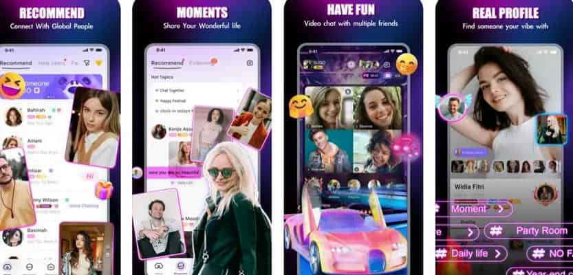
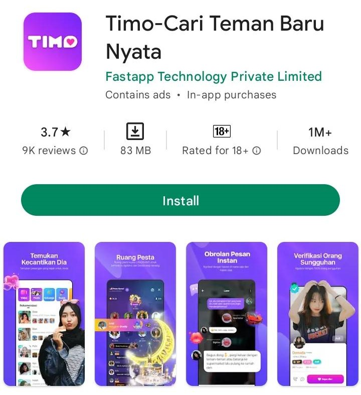
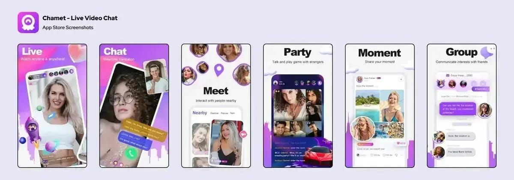

# 竞品 UI 截图索引

> 整理日期：2026-07-22  
> 说明：以下均为公开宣传或商店截图，不等同于当前版本实机验证。

## SUGO

- 来源：[TOPUPLive SUGO 介绍](https://www.topuplive.com/news/everything-about-sugo-voice-live-chat-party.html)
- 原始发布日期：2025-07-03
- 页面：推荐列表、Moments、多人视频/Party、个人主页
- 可观察设计：人物卡片承担发现入口；内容动态和实时互动并列；用真人认证、标签和房间入口强化从浏览到互动的转换。
- 限制：不是 2026 当前版本实机截图，不能用于确认精确入口、价格或交互状态。

## Timo

- 来源：[Teknologi.id Timo 介绍](https://teknologi.id/android/mencari-teman-sekaligus-mendapat-rupiah-aplikasi-timo-punya-caranya)
- 原始发布日期：2022-07-28
- 页面：用户发现、Party Room、即时消息、真人认证
- 可观察设计：以异性人物列表作为主发现面；Party Room 使用高视觉礼物和座位；私聊突出消息与礼物；认证是个人主页的信任组件。
- 限制：属于明显过期的历史截图，只能说明早期信息架构，不能代表 2026 当前 UI。

## Chamet

- 来源：[BitTopup Chamet 文章](https://bittopup.com/article/Chamet-Host-Retention-7-Scripts-to-Keep-Whales-Active)
- 原始发布日期：2025-12-25
- 页面：Live、Chat、Meet、Party、Moment、Group
- 可观察设计：六种互动模式被明确拆分；1v1 视频与翻译直接组合；Nearby/Meet 承担发现；Party 与 Group 区分娱乐和持续社区关系。
- 限制：图片标注为 App Store Screenshots，但由第三方页面转载；需用当前 App Store 或实机再次核对。

## 使用规则

- 报告引用截图时必须注明“公开宣传截图”“商店截图”或“实机截图”。
- 只有当前版本、目标国家、指定账号实机获取的页面才能标记为“已验证 UI”。
- 历史截图可以用于观察信息架构变化，但不能用于当前功能验收。
